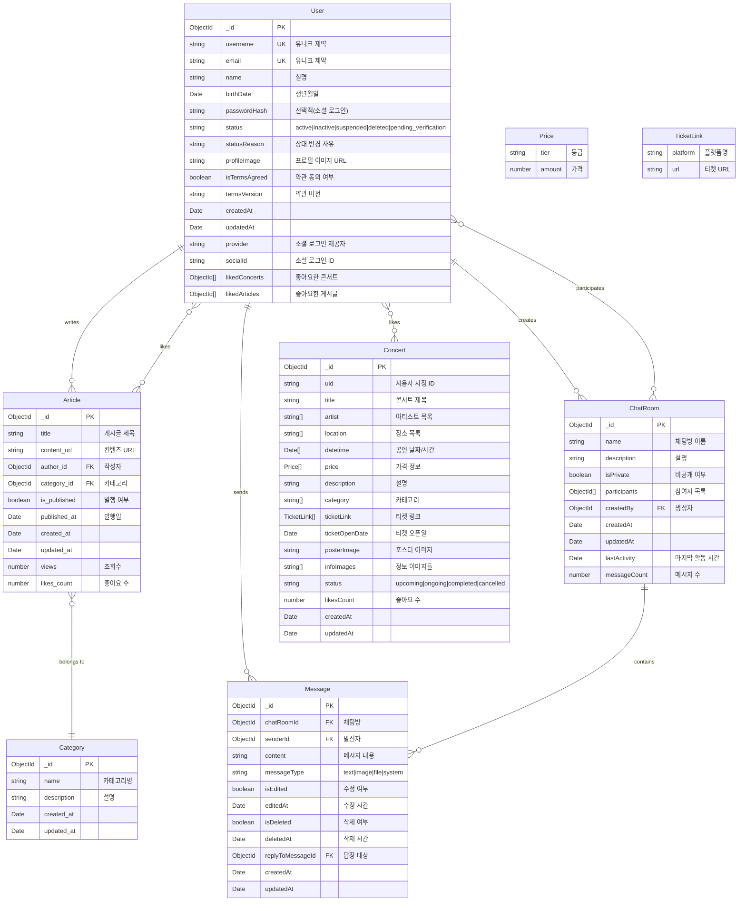

# Entity Relationship Diagram (ERD)

## 데이터베이스: LiveLink (MongoDB)

## 인덱스 정보

### User Collection
- `username`: Unique Index
- `email`: Unique Index
- `status`: Index
- `{provider, socialId}`: Unique Sparse Index (소셜 로그인)

### Concert Collection
- `uid`: Unique Index
- `status`: Index
- `artist`: Index
- `category`: Index
- `datetime`: Index
- `{title, description}`: Text Search Index

### Article Collection
- `{title, content_url}`: Text Search Index
- `{is_published, published_at}`: Compound Index
- `{author_id, created_at}`: Compound Index
- `{category_id, created_at}`: Compound Index

### ChatRoom Collection
- `createdBy`: Index
- `participants`: Index
- `lastActivity`: Descending Index

### Message Collection
- `{chatRoomId, createdAt}`: Compound Index (Descending on createdAt)
- `senderId`: Index
- `replyToMessageId`: Index

## 관계 설명

### User → Article (1:N)
- 한 명의 사용자는 여러 개의 게시글을 작성할 수 있습니다
- `Article.author_id` → `User._id`

### User → ChatRoom (1:N - Creator)
- 한 명의 사용자는 여러 개의 채팅방을 생성할 수 있습니다
- `ChatRoom.createdBy` → `User._id`

### User ↔ ChatRoom (M:N - Participants)
- 사용자는 여러 채팅방에 참여할 수 있습니다
- `ChatRoom.participants[]` ↔ `User._id`

### User → Message (1:N)
- 한 명의 사용자는 여러 개의 메시지를 보낼 수 있습니다
- `Message.senderId` → `User._id`

### ChatRoom → Message (1:N)
- 한 개의 채팅방은 여러 개의 메시지를 포함할 수 있습니다
- `Message.chatRoomId` → `ChatRoom._id`

### User ↔ Concert (M:N - Likes)
- 사용자는 여러 콘서트를 좋아요할 수 있습니다
- `User.likedConcerts[]` ↔ `Concert._id`

### User ↔ Article (M:N - Likes)
- 사용자는 여러 게시글을 좋아요할 수 있습니다
- `User.likedArticles[]` ↔ `Article._id`

### Category → Article (1:N)
- 한 개의 카테고리는 여러 개의 게시글을 포함할 수 있습니다
- `Article.category_id` → `Category._id`

## 데이터베이스 연결 정보

- **Primary Database**: `livelink` (Users, ChatRooms, Messages)
- **Concert Database**: Concerts, Articles, Categories
- **Driver**: MongoDB Native Driver
- **Connection**: MongoDB Atlas / Local MongoDB
