# Entity Relationship Diagram (ERD)

## 데이터베이스: stagelives (MongoDB)

```mermaid
erDiagram
    User ||--o{ Article : "writes"
    User ||--o{ ChatRoom : "creates"
    User ||--o{ Message : "sends"
    User ||--o{ UserSession : "has"
    User ||--o{ Comment : "writes"
    User ||--o{ ArticleLike : "likes"
    User ||--o{ ArticleBookmark : "bookmarks"
    User ||--o{ CommentLike : "likes"
    User ||--o{ ScheduledNotification : "receives"
    User ||--o{ NotificationHistory : "receives"
    User }o--o{ ChatRoom : "participates"
    User }o--o{ Concert : "likes"
    ChatRoom ||--o{ Message : "contains"
    Article }o--|| Category : "belongs to"
    Article ||--o{ Comment : "has"
    Article ||--o{ ArticleLike : "has"
    Article ||--o{ ArticleBookmark : "has"
    Article }o--o{ Tag : "has"
    Comment ||--o{ CommentLike : "has"
    Concert ||--o{ ScheduledNotification : "generates"
    Concert ||--o{ NotificationHistory : "generates"

    User {
        ObjectId _id PK
        string username UK "유니크 제약"
        string email UK "유니크 제약"
        string name "실명"
        Date birthDate "생년월일"
        string passwordHash "선택적(소셜 로그인)"
        string status "active|inactive|suspended|deleted|pending_verification|pending_registration"
        string statusReason "상태 변경 사유"
        string profileImage "프로필 이미지 URL"
        TermsConsent[] termsConsents "약관 동의 배열"
        OAuthProvider[] oauthProviders "OAuth 제공자 목록"
        ObjectId[] likedConcerts "좋아요한 콘서트"
        ObjectId[] likedArticles "좋아요한 게시글"
        string fcmToken "FCM 푸시 알림 토큰"
        Date fcmTokenUpdatedAt "FCM 토큰 업데이트 시간"
        NotificationPreference notificationPreference "알림 설정"
        Date createdAt
        Date updatedAt
    }

    TermsConsent {
        string type "terms|privacy|marketing"
        boolean isAgreed "동의 여부"
        string version "약관 버전"
        Date agreedAt "동의 시간"
    }

    OAuthProvider {
        string provider "google|apple"
        string socialId "OAuth 고유 ID"
        string email "OAuth 이메일"
        Date linkedAt "연동 시간"
    }

    NotificationPreference {
        number[] ticketOpenNotification "티켓 오픈 알림 (분)"
        number[] concertStartNotification "공연 시작 알림 (분)"
    }

    UserSession {
        ObjectId _id PK
        ObjectId userId FK "사용자 ID"
        string sessionId UK "세션 ID"
        DeviceInfo deviceInfo "디바이스 정보"
        Date createdAt "생성 시간"
        Date lastActivityAt "마지막 활동 시간"
        Date expiresAt "만료 시간"
    }

    DeviceInfo {
        string platform "app|web"
        string name "디바이스 이름"
        string userAgent "User Agent"
        string ip "IP 주소"
    }

    Concert {
        ObjectId _id PK
        string uid UK "사용자 지정 ID"
        string title "콘서트 제목"
        string[] artist "아티스트 목록"
        string[] location "장소 목록"
        Date[] datetime "공연 날짜/시간"
        Price[] price "가격 정보"
        string description "설명"
        string[] category "카테고리"
        TicketLink[] ticketLink "티켓 링크"
        TicketOpen[] ticketOpenDate "티켓 오픈일 목록"
        string posterImage "포스터 이미지"
        string[] infoImages "정보 이미지들"
        string status "upcoming|ongoing|completed|cancelled"
        number likesCount "좋아요 수"
        Date createdAt
        Date updatedAt
    }

    Price {
        string tier "등급"
        number amount "가격"
    }

    TicketLink {
        string platform "플랫폼명"
        string url "티켓 URL"
    }

    TicketOpen {
        string openTitle "티켓 오픈 제목"
        Date openDate "티켓 오픈 날짜"
    }

    Article {
        ObjectId _id PK
        string title "게시글 제목"
        string content_url "컨텐츠 URL"
        ObjectId author_id FK "작성자"
        ObjectId category_id FK "카테고리"
        boolean is_published "발행 여부"
        Date published_at "발행일"
        Date created_at
        Date updated_at
        number views "조회수"
        number likes_count "좋아요 수"
    }

    Category {
        ObjectId _id PK
        string name "카테고리명"
        string description "설명"
        Date created_at
        Date updated_at
    }

    Comment {
        ObjectId _id PK
        ObjectId article_id FK "게시글 ID"
        ObjectId author_id FK "작성자 ID"
        ObjectId parent_comment_id FK "부모 댓글 ID"
        string content "댓글 내용"
        boolean is_deleted "삭제 여부"
        Date deleted_at "삭제 시간"
        number likes_count "좋아요 수"
        Date created_at
        Date updated_at
    }

    ArticleLike {
        ObjectId _id PK
        ObjectId user_id FK "사용자 ID"
        ObjectId article_id FK "게시글 ID"
        Date created_at
    }

    ArticleBookmark {
        ObjectId _id PK
        ObjectId user_id FK "사용자 ID"
        ObjectId article_id FK "게시글 ID"
        Date created_at
    }

    CommentLike {
        ObjectId _id PK
        ObjectId user_id FK "사용자 ID"
        ObjectId comment_id FK "댓글 ID"
        Date created_at
    }

    Tag {
        ObjectId _id PK
        string name UK "태그명"
        Date created_at
    }

    ChatRoom {
        ObjectId _id PK
        string name "채팅방 이름"
        string description "설명"
        boolean isPrivate "비공개 여부"
        ObjectId[] participants "참여자 목록"
        ObjectId createdBy FK "생성자"
        Date createdAt
        Date updatedAt
        Date lastActivity "마지막 활동 시간"
        number messageCount "메시지 수"
    }

    Message {
        ObjectId _id PK
        ObjectId chatRoomId FK "채팅방"
        ObjectId senderId FK "발신자"
        string content "메시지 내용"
        string messageType "text|image|file|system"
        boolean isEdited "수정 여부"
        Date editedAt "수정 시간"
        boolean isDeleted "삭제 여부"
        Date deletedAt "삭제 시간"
        ObjectId replyToMessageId FK "답장 대상"
        Date createdAt
        Date updatedAt
    }

    ScheduledNotification {
        ObjectId _id PK
        ObjectId userId FK "알림 받을 사용자"
        ObjectId concertId FK "공연 ID"
        string title "알림 제목"
        string message "알림 메시지"
        object data "추가 데이터"
        Date scheduledAt "예약 전송 시간"
        string status "pending|sent|failed|cancelled"
        Date sentAt "실제 전송 시간"
        string errorReason "실패 사유"
        Date createdAt
        Date updatedAt
    }

    NotificationHistory {
        ObjectId _id PK
        ObjectId userId FK "알림 받은 사용자"
        ObjectId concertId FK "공연 ID"
        string title "알림 제목"
        string message "알림 메시지"
        string type "알림 타입"
        boolean isRead "읽음 여부"
        Date readAt "읽은 시간"
        Date sentAt "전송 시간"
        object data "추가 데이터"
        Date createdAt
        Date expiresAt "TTL 만료 시간"
    }
```

## 인덱스 정보

### User Collection
- `username`: Unique Index
- `email`: Unique Index
- `status`: Index
- `{oauthProviders.provider, oauthProviders.socialId}`: Unique Sparse Index

### UserSession Collection
- `userId`: Index
- `sessionId`: Unique Index
- `expiresAt`: TTL Index (자동 삭제)
- `{userId, sessionId}`: Compound Index

### Concert Collection
- `uid`: Unique Index
- `status`: Index
- `artist`: Index
- `category`: Index
- `datetime`: Index
- `{title, description}`: Text Search Index

### Article Collection
- `{title, content_url}`: Text Search Index
- `{is_published, published_at}`: Compound Index
- `{author_id, created_at}`: Compound Index
- `{category_id, created_at}`: Compound Index

### Comment Collection
- `article_id`: Index
- `author_id`: Index
- `parent_comment_id`: Index
- `{article_id, created_at}`: Compound Index

### ArticleLike Collection
- `{user_id, article_id}`: Unique Compound Index
- `article_id`: Index

### ArticleBookmark Collection
- `{user_id, article_id}`: Unique Compound Index
- `article_id`: Index

### CommentLike Collection
- `{user_id, comment_id}`: Unique Compound Index
- `comment_id`: Index

### Tag Collection
- `name`: Unique Index

### ChatRoom Collection
- `createdBy`: Index
- `participants`: Index
- `lastActivity`: Descending Index

### Message Collection
- `{chatRoomId, createdAt}`: Compound Index (Descending on createdAt)
- `senderId`: Index
- `replyToMessageId`: Index

### ScheduledNotification Collection
- `{status, scheduledAt}`: Compound Index
- `{userId, status}`: Compound Index
- `{concertId, status}`: Compound Index
- `scheduledAt`: Index

### NotificationHistory Collection
- `{userId, isRead}`: Compound Index
- `{userId, createdAt}`: Compound Index (Descending)
- `concertId`: Index
- `expiresAt`: TTL Index (자동 삭제)

## 관계 설명

### User → Article (1:N)
- 한 명의 사용자는 여러 개의 게시글을 작성할 수 있습니다
- `Article.author_id` → `User._id`

### User → ChatRoom (1:N - Creator)
- 한 명의 사용자는 여러 개의 채팅방을 생성할 수 있습니다
- `ChatRoom.createdBy` → `User._id`

### User ↔ ChatRoom (M:N - Participants)
- 사용자는 여러 채팅방에 참여할 수 있습니다
- `ChatRoom.participants[]` ↔ `User._id`

### User → Message (1:N)
- 한 명의 사용자는 여러 개의 메시지를 보낼 수 있습니다
- `Message.senderId` → `User._id`

### User → UserSession (1:N)
- 한 명의 사용자는 여러 개의 활성 세션을 가질 수 있습니다 (플랫폼별 1개씩)
- `UserSession.userId` → `User._id`

### User → Comment (1:N)
- 한 명의 사용자는 여러 개의 댓글을 작성할 수 있습니다
- `Comment.author_id` → `User._id`

### User → ArticleLike (1:N)
- 한 명의 사용자는 여러 게시글에 좋아요할 수 있습니다
- `ArticleLike.user_id` → `User._id`

### User → ArticleBookmark (1:N)
- 한 명의 사용자는 여러 게시글을 북마크할 수 있습니다
- `ArticleBookmark.user_id` → `User._id`

### User → CommentLike (1:N)
- 한 명의 사용자는 여러 댓글에 좋아요할 수 있습니다
- `CommentLike.user_id` → `User._id`

### ChatRoom → Message (1:N)
- 한 개의 채팅방은 여러 개의 메시지를 포함할 수 있습니다
- `Message.chatRoomId` → `ChatRoom._id`

### User ↔ Concert (M:N - Likes)
- 사용자는 여러 콘서트를 좋아요할 수 있습니다
- `User.likedConcerts[]` ↔ `Concert._id`

### User ↔ Article (M:N - Likes via ArticleLike)
- 사용자는 여러 게시글을 좋아요할 수 있습니다
- `ArticleLike` 테이블을 통한 관계

### Category → Article (1:N)
- 한 개의 카테고리는 여러 개의 게시글을 포함할 수 있습니다
- `Article.category_id` → `Category._id`

### Article → Comment (1:N)
- 한 개의 게시글은 여러 개의 댓글을 가질 수 있습니다
- `Comment.article_id` → `Article._id`

### Comment → Comment (1:N - 대댓글)
- 댓글은 여러 개의 대댓글을 가질 수 있습니다
- `Comment.parent_comment_id` → `Comment._id`

### Article ↔ Tag (M:N via ArticleTag)
- 게시글은 여러 태그를 가질 수 있고, 태그는 여러 게시글에 사용될 수 있습니다

### Concert → ScheduledNotification (1:N)
- 한 개의 콘서트는 여러 개의 예약 알림을 생성할 수 있습니다
- `ScheduledNotification.concertId` → `Concert._id`

### User → ScheduledNotification (1:N)
- 한 명의 사용자는 여러 개의 예약 알림을 받을 수 있습니다
- `ScheduledNotification.userId` → `User._id`

### Concert → NotificationHistory (1:N)
- 한 개의 콘서트는 여러 개의 알림 이력을 생성할 수 있습니다
- `NotificationHistory.concertId` → `Concert._id`

### User → NotificationHistory (1:N)
- 한 명의 사용자는 여러 개의 알림 이력을 받을 수 있습니다
- `NotificationHistory.userId` → `User._id`

## 데이터베이스 연결 정보

- **Primary Database**: `stagelives` (Users, UserSessions, ChatRooms, Messages, Notifications)
- **Concert Database**: Concerts
- **Article Database**: Articles, Categories, Comments, Tags, Likes, Bookmarks
- **Driver**: MongoDB Native Driver
- **Connection**: MongoDB Atlas / Local MongoDB

## 주요 특징

### 1. 다중 디바이스 세션 관리
- `UserSession` 컬렉션으로 플랫폼별 (웹/앱) 세션 관리
- TTL 인덱스로 만료된 세션 자동 정리
- 플랫폼별 세션 만료 시간 차별화 (웹: 1일, 앱: 30일)

### 2. 알림 시스템
- `ScheduledNotification`: 예약 알림 (티켓 오픈, 공연 시작 등)
- `NotificationHistory`: 알림 이력 및 읽음 상태 관리
- TTL 인덱스로 오래된 알림 자동 정리

### 3. OAuth 다중 제공자 지원
- `User.oauthProviders` 배열로 Google, Apple 등 여러 OAuth 동시 연동
- 기존 계정에 OAuth 추가 가능

### 4. 약관 동의 관리
- `User.termsConsents` 배열로 여러 약관 (서비스, 개인정보, 마케팅) 관리
- 약관 버전 및 동의 시간 추적

### 5. 게시글 상호작용
- 좋아요, 북마크, 댓글, 태그 등 풍부한 상호작용 지원
- 대댓글 지원 (`Comment.parent_comment_id`)

### 6. FCM 푸시 알림
- `User.fcmToken`으로 디바이스별 푸시 알림 관리
- 알림 설정 커스터마이징 (`NotificationPreference`)

---

**Last Updated:** 2025-11-10
**Version:** 0.9.0
