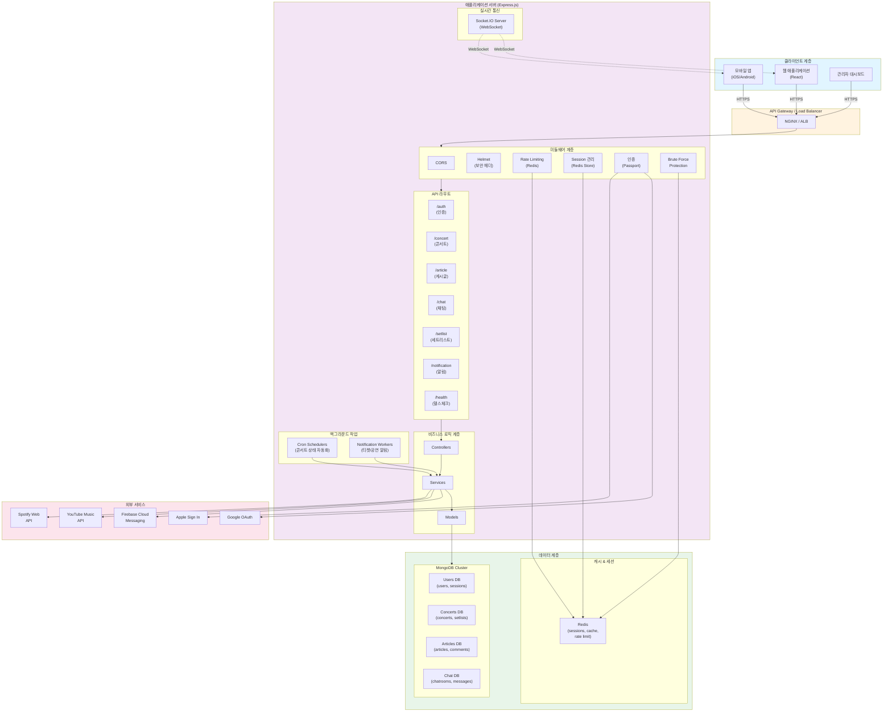
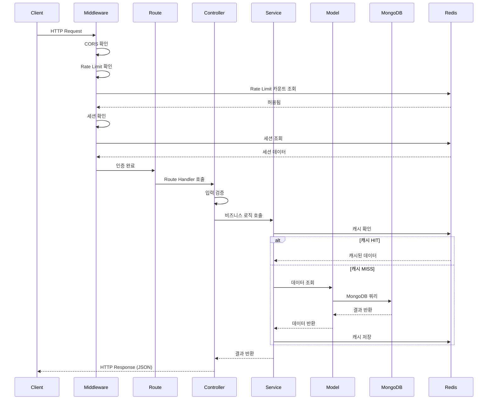
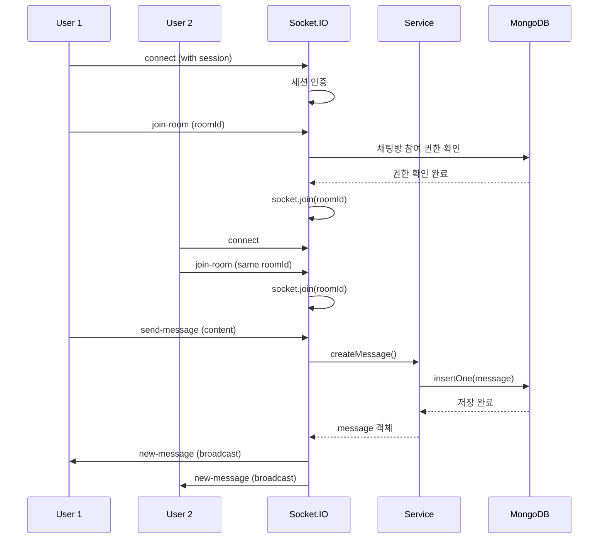
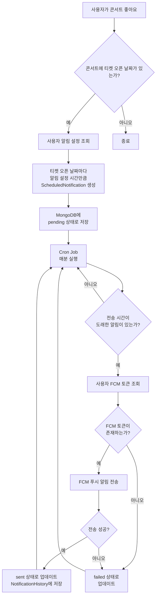
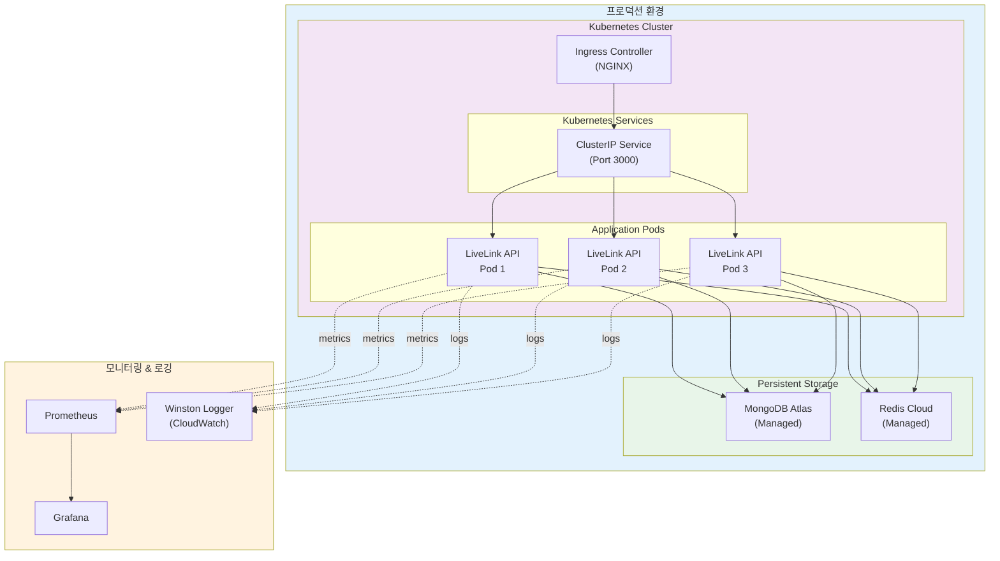

# LiveLink Backend Architecture Documentation

## 📚 문서 목록

### 1. [ERD (Entity Relationship Diagram)](./ERD.md)
데이터베이스 스키마 및 엔티티 관계 다이어그램

**주요 컬렉션:**
- User (사용자)
- Concert (콘서트)
- Article (게시글)
- ChatRoom (채팅방)
- Message (메시지)
- Category (카테고리)

### 2. [Sequence Diagrams](./SEQUENCE_DIAGRAMS.md)
주요 비즈니스 로직의 시퀀스 다이어그램

**포함된 플로우:**
- 사용자 회원가입 및 인증
- 소셜 로그인 (Google OAuth)
- 콘서트 조회 및 좋아요 (캐싱 포함)
- 실시간 채팅 (Socket.IO)
- 게시글 작성
- Brute Force Protection
- Health Check & Monitoring

## 🏗️ 시스템 아키텍처 개요



### 계층별 상세 설명

#### 1. 클라이언트 계층
- **웹 애플리케이션**: React 기반 SPA
- **모바일 앱**: iOS/Android 네이티브 앱
- **관리자 대시보드**: 콘서트/사용자 관리

#### 2. API Gateway
- HTTPS 종단점
- 로드 밸런싱
- SSL/TLS 종료

#### 3. 애플리케이션 서버
- **미들웨어**: 보안, 인증, Rate Limiting
- **API 라우트**: RESTful 엔드포인트
- **비즈니스 로직**: MVC 패턴 (Controller → Service → Model)
- **실시간 통신**: Socket.IO WebSocket 서버
- **백그라운드 작업**: Cron 기반 스케줄러

#### 4. 데이터 계층
- **MongoDB**: 4개의 분리된 데이터베이스 (Users, Concerts, Articles, Chat)
- **Redis**: 세션 스토어, 캐싱, Rate Limiting

#### 5. 외부 서비스
- **FCM**: 푸시 알림
- **YouTube/Spotify**: 재생목록 생성
- **OAuth Providers**: Google, Apple 소셜 로그인

## 📊 데이터 플로우 다이어그램

### 전형적인 API 요청 처리 흐름



### 실시간 채팅 플로우



### 알림 시스템 플로우



## 🔑 핵심 기술 스택

### Backend Framework
- **Express.js** 4.18.2
- **TypeScript** 5.3.3
- **Node.js** >=18.0.0

### Databases
- **MongoDB** 6.20.0 (Native Driver)
  - User Database (livelink)
  - Concert Database
  - Article Database
  - Chat Database

### Caching & Session
- **Redis** 4.6.5 (Legacy Mode)
- **connect-redis** 6.1.3 (Session Store)
- **ioredis** 5.6.1 (Available)

### Real-time Communication
- **Socket.IO** 4.7.5

### Authentication
- **Passport.js** 0.7.0
- **passport-google-oauth20** 2.0.0
- **passport-apple** 2.0.2

### Security
- **helmet** 7.2.0
- **express-mongo-sanitize** 2.2.0
- **sanitize-html** 2.17.0
- **hpp** 0.2.3
- **express-rate-limit** 7.5.1
- **rate-limit-redis** 4.2.2

### GraphQL
- **apollo-server-express** 3.13.0
- **graphql** 16.11.0

### Monitoring
- **prom-client** 15.1.2 (Prometheus Metrics)
- **winston** 3.18.3 (Logging)

## 📁 프로젝트 구조

```
LiveLink_BE/
├── src/
│   ├── config/           # 설정 파일
│   │   ├── env/          # 환경 변수
│   │   ├── oauth/        # OAuth 설정
│   │   ├── redis/        # Redis 클라이언트
│   │   └── swagger/      # Swagger 문서
│   ├── models/           # 데이터 모델
│   │   ├── auth/         # User 모델
│   │   ├── concert/      # Concert 모델
│   │   ├── article/      # Article 모델
│   │   └── chat/         # ChatRoom, Message 모델
│   ├── routes/           # API 라우트
│   │   ├── auth/         # 인증 라우트
│   │   ├── concert/      # 콘서트 라우트
│   │   ├── article/      # 게시글 라우트
│   │   └── chat/         # 채팅 라우트
│   ├── controllers/      # 컨트롤러
│   ├── services/         # 비즈니스 로직
│   │   ├── auth/         # 인증 서비스
│   │   ├── security/     # 보안 서비스 (Brute Force)
│   │   └── concert/      # 콘서트 서비스
│   ├── middlewares/      # 미들웨어
│   │   ├── auth/         # 인증 미들웨어
│   │   ├── security/     # 보안 미들웨어 (Rate Limit)
│   │   └── error/        # 에러 핸들러
│   ├── utils/            # 유틸리티
│   │   ├── cache/        # 캐시 매니저
│   │   ├── logger/       # 로거
│   │   └── database/     # DB 유틸
│   ├── socket/           # Socket.IO 서버
│   ├── report/           # GraphQL Report 서비스
│   └── app.ts            # 메인 애플리케이션
├── docs/
│   └── architecture/     # 아키텍처 문서
├── REDIS_VERSION.md      # Redis 버전 관리 가이드
└── package.json
```

## 🔒 보안 기능

### 1. Rate Limiting
- **Default**: 60초에 100회
- **Strict**: 60초에 20회 (로그인 등)
- **Relaxed**: 60초에 200회
- Redis 기반 분산 환경 지원

### 2. Brute Force Protection
- 로그인 시도 횟수 제한 (5회)
- 차단 시 30분 대기
- Redis 기반 상태 관리

### 3. XSS Protection
- `sanitize-html`로 모든 입력 sanitize
- `helmet` CSP 설정

### 4. NoSQL Injection Prevention
- `express-mongo-sanitize`로 쿼리 sanitize
- MongoDB Native Driver 사용

### 5. Session Security
- HttpOnly 쿠키
- SameSite 정책
- Secure 플래그 (프로덕션)
- Redis 세션 스토어

## 🚀 주요 기능

### 1. 인증 시스템
- 이메일/비밀번호 회원가입
- 소셜 로그인 (Google, Apple)
- 세션 기반 인증
- 비밀번호 찾기/재설정

### 2. 콘서트 관리
- 콘서트 CRUD
- 좋아요 기능
- 검색 및 필터링
- 상태 자동 업데이트 (Scheduler)
- 캐싱 (Redis)

### 3. 게시판
- 게시글 CRUD
- 카테고리 분류
- 좋아요 및 조회수
- 텍스트 검색

### 4. 실시간 채팅
- Socket.IO 기반
- 채팅방 생성/참여
- 메시지 전송/수정/삭제
- 실시간 알림

### 5. GraphQL API
- Apollo Server
- Report 시스템

## 🩺 모니터링 & Health Check

### Health Check Endpoints
- **Liveness**: `/health/liveness` - 서버 생존 확인
- **Readiness**: `/health/readiness` - 서비스 준비 상태
- **General**: `/health` - 전체 상태 + 버전 정보

### Prometheus Metrics
- `/metrics` - Prometheus 메트릭
- HTTP 요청 수/시간
- 데이터베이스 연결 상태
- Redis 연결 상태
- 에러 발생 횟수

### Logging
- **Winston** 기반 구조화된 로깅
- Daily Rotate File
- 로그 레벨: error, warn, info, debug
- 프로덕션 환경 최적화

## 🔧 Redis 활용

### 1. Session Store
- Express Session + connect-redis
- 세션 영속성 보장
- Graceful Degradation (메모리 기반 fallback)

### 2. Caching
- 콘서트 목록
- TTL 기반 자동 만료

### 3. Rate Limiting
- IP 기반 요청 제한
- 분산 환경 지원

### 4. Brute Force Protection
- 로그인 시도 카운트
- 차단 상태 관리

## 📊 성능 최적화

### Database Indexing
- 복합 인덱스 활용
- 텍스트 검색 인덱스
- Sparse 인덱스 (소셜 로그인)

### Caching Strategy
- Redis 캐싱
- TTL 기반 자동 갱신
- Cache Invalidation

### Connection Pooling
- MongoDB Native Driver 연결 풀
- Redis 연결 재사용

## 🛡️ Graceful Degradation

Redis 장애 시에도 서비스 계속 운영:
- ✅ 세션: 메모리 기반으로 자동 전환
- ✅ Rate Limiting: 메모리 기반 동작
- ✅ Brute Force: 비활성화 (경고 로그)
- ✅ Caching: DB 직접 조회

## 📝 API 문서

### Swagger UI
- `/api-docs` - Interactive API Documentation

### GraphQL Playground
- `/graphql` - GraphQL API Explorer

## 🔗 관련 문서

- [ERD 다이어그램](./ERD.md)
- [시퀀스 다이어그램](./SEQUENCE_DIAGRAMS.md)
- [Redis 버전 관리 가이드](../../REDIS_VERSION.md)

---

## 🔄 배포 아키텍처



### 배포 특징

1. **Horizontal Scaling**: Kubernetes를 통한 자동 스케일링
2. **Zero-Downtime Deployment**: Rolling update 전략
3. **Health Checks**: Readiness/Liveness Probes
4. **Session Persistence**: Redis 기반 공유 세션
5. **Graceful Shutdown**: SIGTERM 핸들링

## 🛡️ 보안 아키텍처

```mermaid
graph LR
    Client["Client"] -->|1. TLS/HTTPS| Gateway["API Gateway"]
    Gateway -->|2. Rate Limiting| RateLimit["Rate Limiter"]
    RateLimit -->|3. Session Check| Session["Session Store"]
    Session -->|4. Authentication| Auth["Auth Middleware"]
    Auth -->|5. Input Validation| Validation["Validator"]
    Validation -->|6. Sanitization| Sanitize["Sanitizer<br/>(XSS/NoSQL)"]
    Sanitize -->|7. Authorization| RBAC["RBAC Check"]
    RBAC -->|8. Business Logic| Service["Service Layer"]

    style Gateway fill:#ffcdd2
    style RateLimit fill:#f8bbd0
    style Session fill:#e1bee7
    style Auth fill:#d1c4e9
    style Validation fill:#c5cae9
    style Sanitize fill:#bbdefb
    style RBAC fill:#b3e5fc
    style Service fill:#b2ebf2
```



### 보안 계층

1. **Network Level**: TLS/HTTPS, CORS
2. **Rate Limiting**: IP 기반 요청 제한
3. **Session Security**: HttpOnly cookies, SameSite
4. **Authentication**: Passport.js, OAuth
5. **Input Validation**: Joi/Zod 스키마
6. **Sanitization**: XSS, NoSQL Injection 방지
7. **Authorization**: Role-based Access Control
8. **Audit Logging**: 모든 중요 작업 로깅

---

**마지막 업데이트:** 2025-11-20
**버전:** 1.1.0
**문서 작성자:** Architecture Documentation Team
