# Sequence Diagrams - stagelives API

## 1. 사용자 회원가입 및 인증 플로우

### 1.1 이메일 회원가입

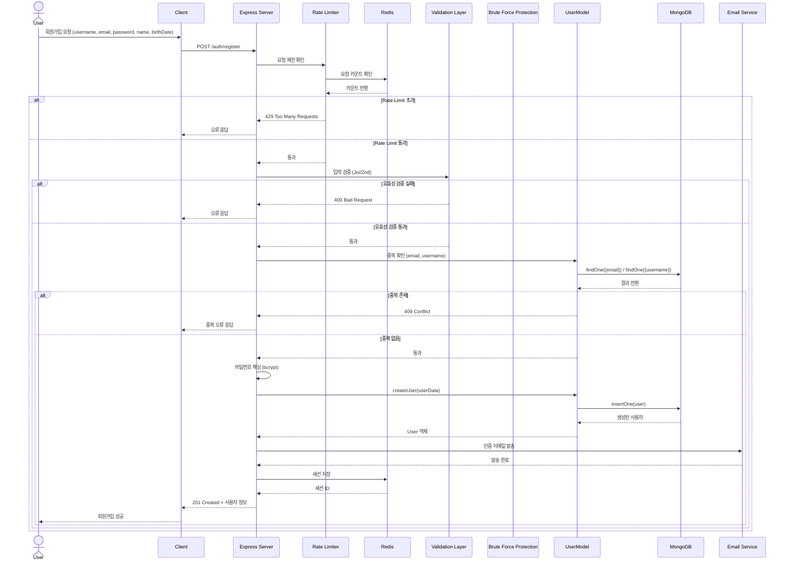

### 1.2 소셜 로그인 (Google OAuth) - 다중 OAuth 지원

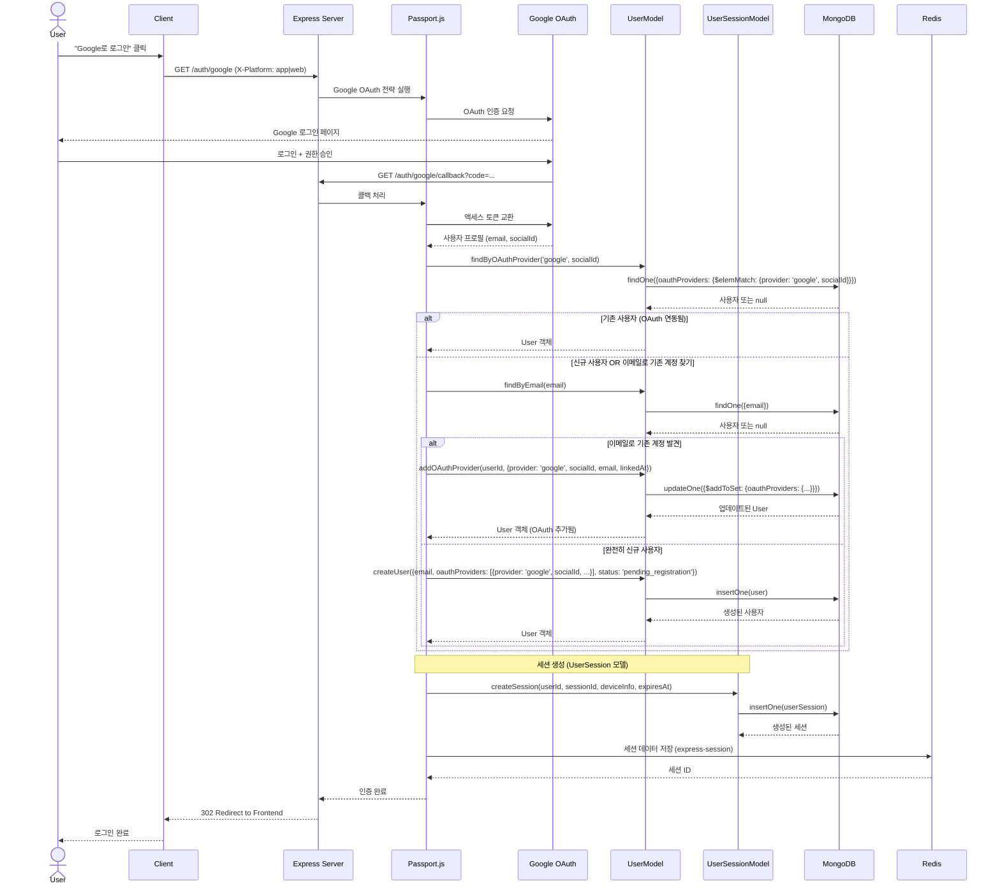

## 2. 콘서트 조회 및 좋아요

### 2.1 콘서트 목록 조회 (캐싱 포함)

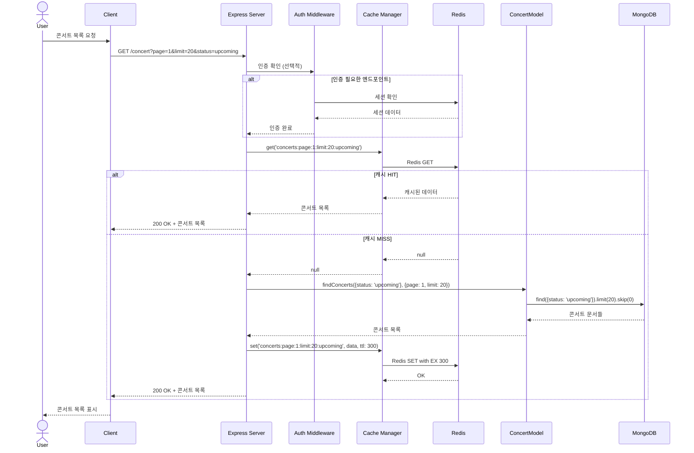

### 2.2 콘서트 좋아요

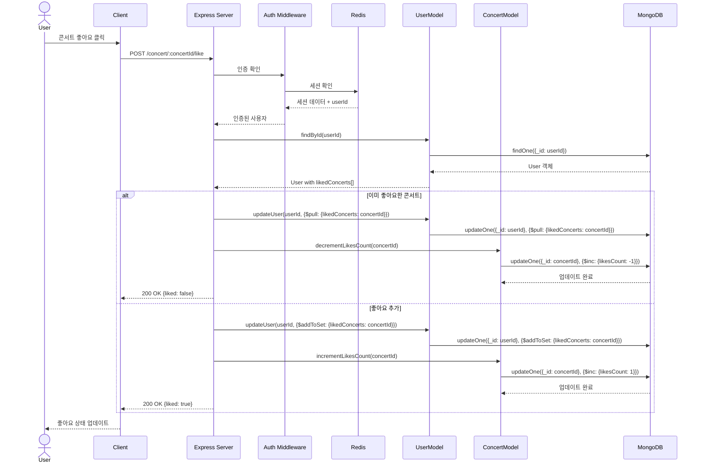

## 3. 실시간 채팅 (Socket.IO)

### 3.1 채팅방 입장 및 메시지 전송

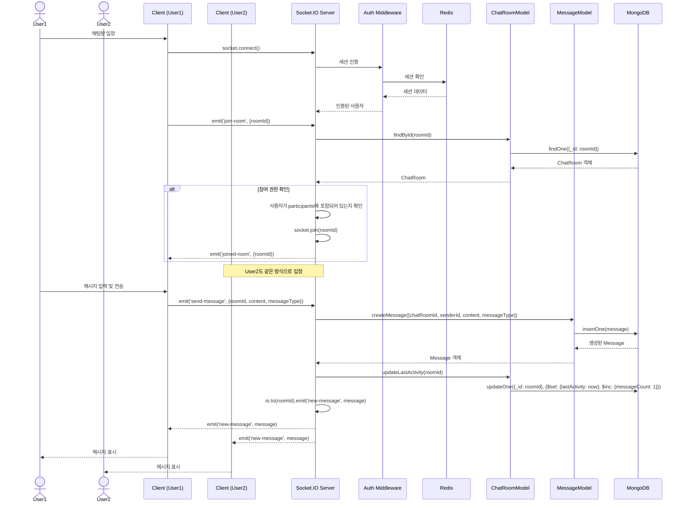

## 4. 게시글 작성 및 조회

### 4.1 게시글 작성

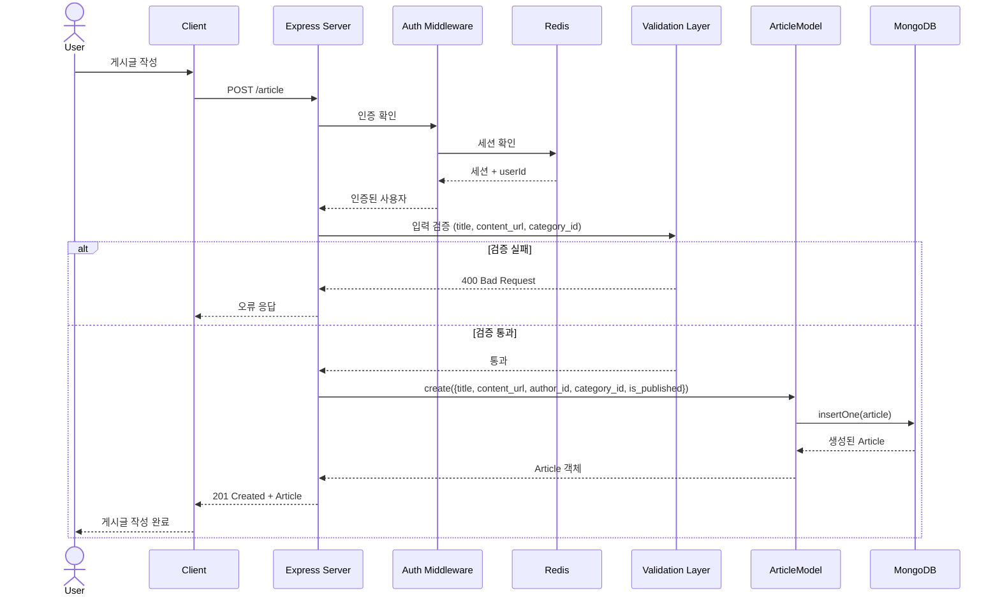

## 5. Brute Force Protection

### 5.1 로그인 시도 제한

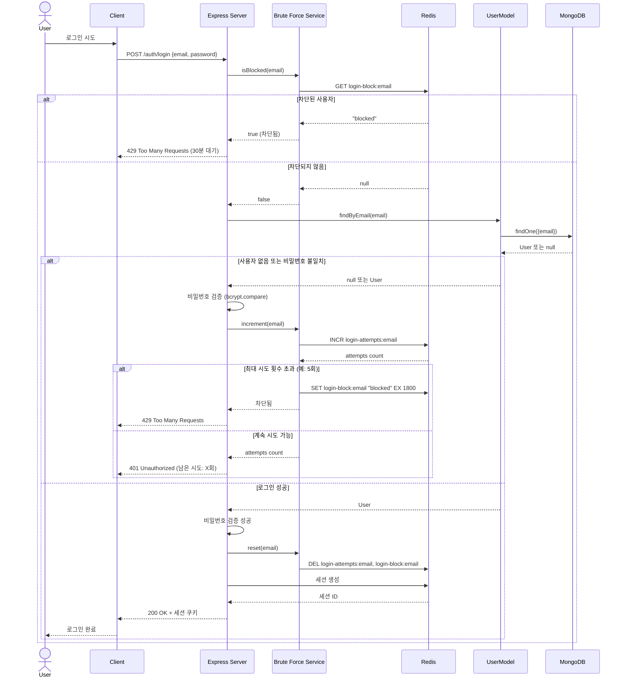

## 6. 세션 관리 (다중 디바이스)

### 6.1 활성 세션 조회

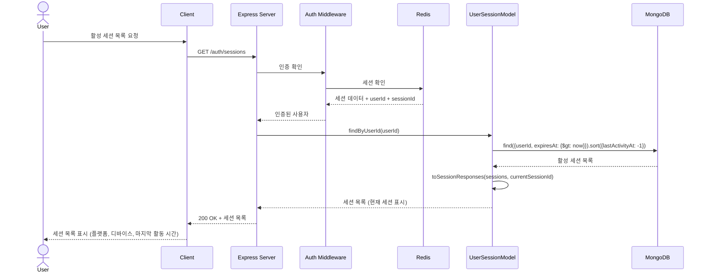

### 6.2 특정 세션 종료

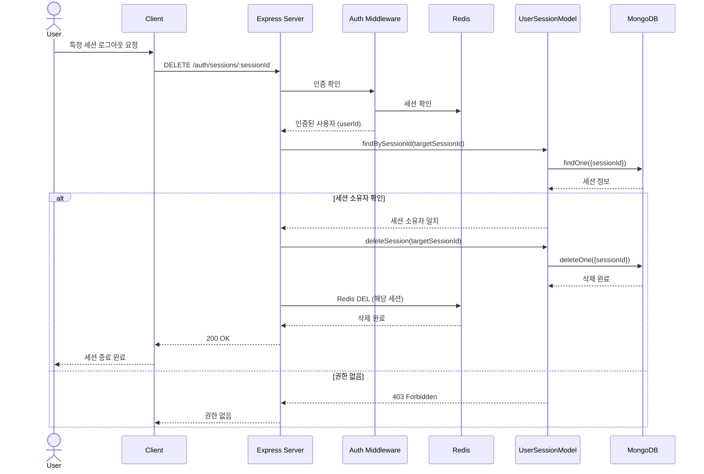

### 6.3 플랫폼별 세션 교체 (로그인)

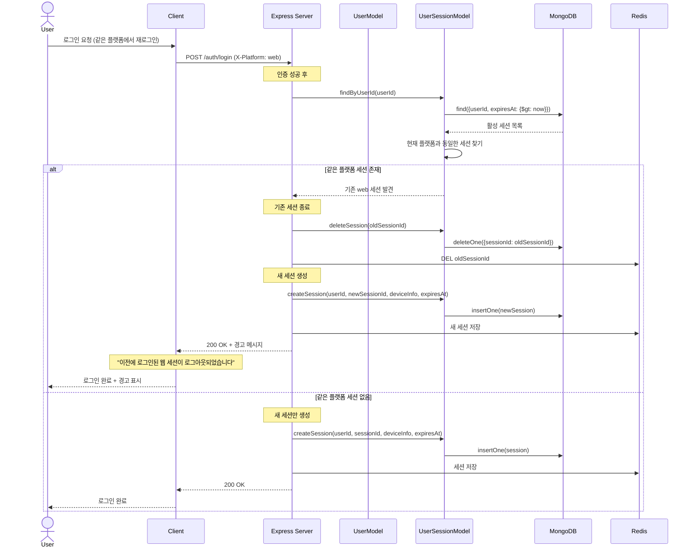

## 7. 알림 시스템

### 7.1 티켓 오픈 알림 예약

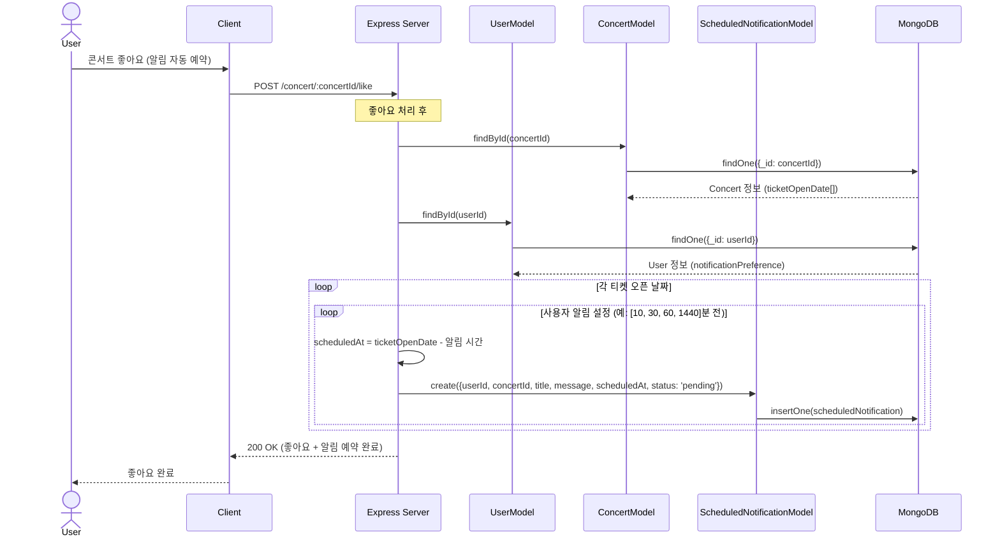

### 7.2 예약 알림 전송 (크론 작업)

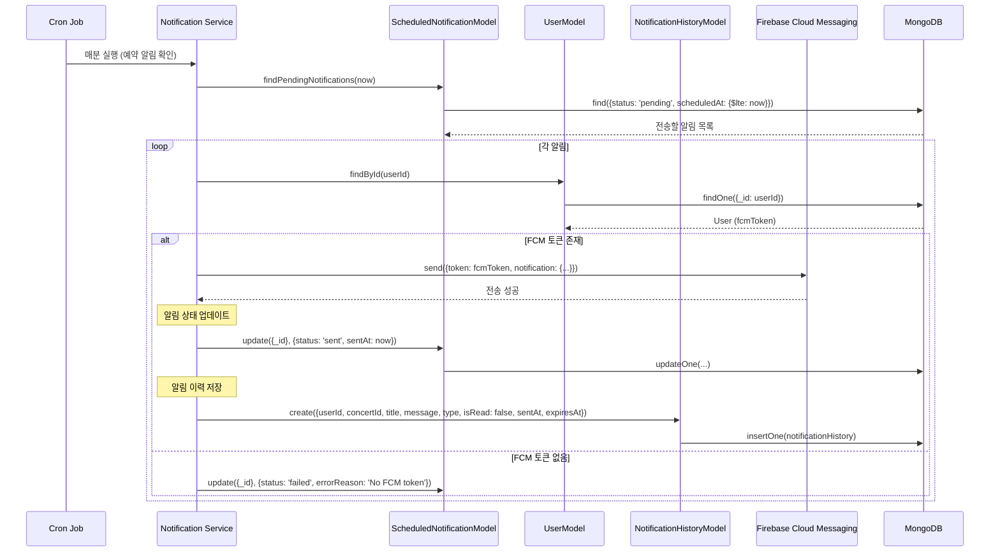

## 8. Health Check & Monitoring

### 8.1 Readiness Probe

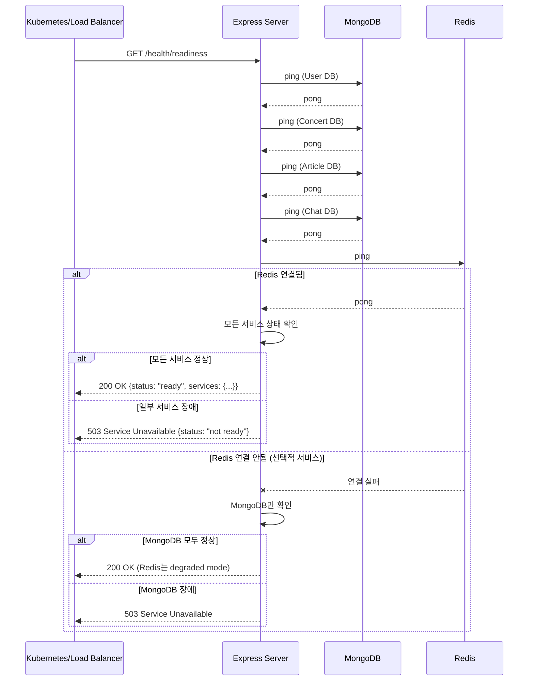

## 시스템 아키텍처 특징

### Redis 활용
1. **세션 스토어**: Express Session + connect-redis
2. **Rate Limiting**: rate-limit-redis
3. **Brute Force Protection**: 로그인 시도 횟수 추적
4. **캐싱**: 콘서트 목록 등 자주 조회되는 데이터

### Graceful Degradation
- Redis 장애 시 메모리 기반 세션으로 자동 전환
- Rate Limiting 메모리 기반으로 동작
- 서비스 중단 없이 degraded mode 운영

### 보안 기능
- **Rate Limiting**: API 요청 제한 (기본, 엄격, 완화)
- **Brute Force Protection**: 로그인 시도 제한
- **XSS Protection**: sanitize-html
- **NoSQL Injection**: express-mongo-sanitize
- **HPP**: hpp (HTTP Parameter Pollution)
- **Helmet**: 보안 헤더

---

**Last Updated:** 2025-11-10
**Version:** 1.0.0
