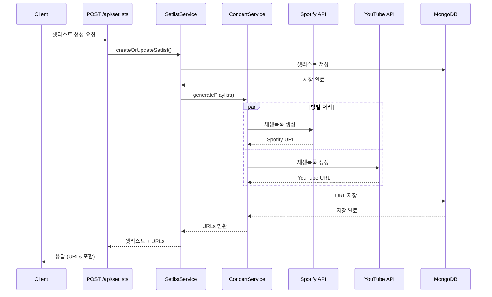

# 🎵 자동 재생목록 생성 기능

## 개요

LiveLink는 콘서트 셋리스트를 기반으로 **Spotify**와 **YouTube Music** 재생목록을 자동으로 생성하는 기능을 제공합니다.

## 주요 기능

- ✅ **자동 생성**: 셋리스트 저장 시 재생목록 자동 생성
- 🔄 **병렬 처리**: Spotify와 YouTube Music 동시 생성
- 🎯 **스마트 검색**: 곡 제목과 아티스트로 정확한 트랙 매칭
- 💾 **URL 저장**: 생성된 재생목록 URL을 DB에 저장 및 반환
- 🛡️ **에러 처리**: 일부 곡 실패 시에도 나머지 곡 처리 계속
- 🔐 **토큰 관리**: Access Token 자동 갱신

## API 사용 방법

### 1. 셋리스트 생성 (재생목록 자동 생성)

```http
POST /api/setlists
Content-Type: application/json

{
  "concertId": "concert-uid-12345",
  "setList": [
    {
      "title": "Dynamite",
      "artist": "BTS"
    },
    {
      "title": "봄날",
      "artist": "방탄소년단"
    }
  ]
}
```

**응답**:
```json
{
  "success": true,
  "data": {
    "_id": "674325abc123...",
    "concertId": "concert-uid-12345",
    "setList": [...],
    "youtubePlaylistUrl": "https://www.youtube.com/playlist?list=PLxxx...",
    "spotifyPlaylistUrl": "https://open.spotify.com/playlist/xxx...",
    "createdAt": "2025-11-19T08:34:21.000Z",
    "updatedAt": "2025-11-19T08:34:21.000Z"
  },
  "message": "셋리스트가 생성되었습니다."
}
```

### 2. 셋리스트 조회 (재생목록 URL 포함)

```http
GET /api/setlists/:concertId
```

**응답**:
```json
{
  "success": true,
  "data": {
    "_id": "674325abc123...",
    "concertId": "concert-uid-12345",
    "setList": [...],
    "youtubePlaylistUrl": "https://www.youtube.com/playlist?list=PLxxx...",
    "spotifyPlaylistUrl": "https://open.spotify.com/playlist/xxx...",
    "createdAt": "2025-11-19T08:34:21.000Z",
    "updatedAt": "2025-11-19T08:34:21.000Z"
  }
}
```

## 동작 방식



## 재생목록 생성 프로세스

### Spotify

1. **Access Token 갱신**: Refresh Token으로 새 Access Token 발급 (캐싱)
2. **곡 검색**: `/v1/search?type=track&q=track:{title} artist:{artist}`
3. **재생목록 생성**: `/v1/users/{user_id}/playlists`
4. **트랙 추가**: `/v1/playlists/{playlist_id}/tracks` (최대 100곡씩 배치 처리)
5. **URL 반환**: `https://open.spotify.com/playlist/{playlist_id}`

### YouTube Music

1. **곡 검색**: YouTube Data API v3 `/search?part=snippet&type=video&q={title} {artist}`
2. **재생목록 생성**: `/playlists?part=snippet`
3. **동영상 추가**: `/playlistItems?part=snippet` (곡마다 개별 요청)
4. **URL 반환**: `https://www.youtube.com/playlist?list={playlist_id}`

## 에러 처리

### 곡 검색 실패

```
⚠️ 곡을 찾을 수 없습니다: 곡제목 - 아티스트 (Spotify)
```

- 해당 곡은 건너뛰고 다음 곡 처리
- 찾은 곡만으로 재생목록 생성
- 셋리스트 저장은 항상 성공

### API 인증 실패

```
❌ Spotify 재생목록 생성 실패: Request failed with status code 403
```

- Refresh Token 스코프 부족 또는 만료
- 재생목록 생성 실패하지만 셋리스트는 저장됨
- 로그에서 구체적인 오류 확인

### Rate Limit 초과

```
⚠️ Spotify Rate Limit 초과. Retry-After: 30초
```

- 429 응답 시 Retry-After 헤더 로깅
- 자동 재시도 없음 (수동 재시도 필요)

## 성능 최적화

- ✅ **토큰 캐싱**: Access Token을 메모리에 캐시 (5분 버퍼)
- ✅ **병렬 처리**: Spotify와 YouTube 동시 요청 (`Promise.allSettled`)
- ✅ **배치 처리**: Spotify 트랙 추가 시 100곡씩 배치
- ✅ **에러 격리**: 한 플랫폼 실패 시 다른 플랫폼은 계속 진행

## 설정 가이드

자세한 설정 방법은 [MUSIC_SERVICES_SETUP.md](./MUSIC_SERVICES_SETUP.md)를 참고하세요.

**간단 요약**:

1. **Spotify**:
   ```bash
   node scripts/spotify-token-generator.js
   # 브라우저에서 인증 → Refresh Token 복사 → .env에 저장
   ```

2. **YouTube**:
   - Google Cloud Console에서 YouTube Data API v3 활성화
   - OAuth 2.0 자격 증명 생성
   - Refresh Token 생성 및 .env에 저장

3. **서버 재시작**:
   ```bash
   npm run dev
   ```

## 제한 사항

| 항목 | Spotify | YouTube Music |
|------|---------|---------------|
| 일일 할당량 | 무제한 (합리적 사용) | 10,000 units |
| Rate Limit | 30초당 ~30회 | 프로젝트별 제한 |
| 최대 트랙 수 | 10,000곡/재생목록 | 5,000곡/재생목록 |
| 배치 추가 | 100곡/요청 | 1곡/요청 |
| 검색 정확도 | 높음 | 중간 (비공식 영상 포함) |

## 로그 예시

```
[2025-11-19 17:34:21] info: 🎵 재생목록 자동 생성 시작: concert-uid-12345 (10곡)
[2025-11-19 17:34:22] info: ✅ Spotify 재생목록 생성 완료: My Concert Setlist (10/10곡)
[2025-11-19 17:34:23] info: ✅ YouTube 재생목록 생성 완료: My Concert Setlist (9/10곡)
[2025-11-19 17:34:23] warn: ⚠️ 곡을 찾을 수 없습니다: Unknown Song - Unknown Artist (YouTube)
[2025-11-19 17:34:23] info: ✅ 재생목록 자동 생성 완료 (YouTube: true, Spotify: true)
```

## 관련 파일

- **서비스**: `src/services/concert/spotifyService.ts`, `src/services/concert/youtubeMusicService.ts`
- **컨트롤러**: `src/services/setlist/setlistService.ts`
- **타입**: `src/models/concert/base/ConcertTypes.ts`
- **환경 변수**: `.env`, `.env.example`
- **스크립트**: `scripts/spotify-token-generator.js`

## 문제 해결

문제가 발생하면 [MUSIC_SERVICES_SETUP.md - 문제 해결 섹션](./MUSIC_SERVICES_SETUP.md#문제-해결)을 참고하세요.
